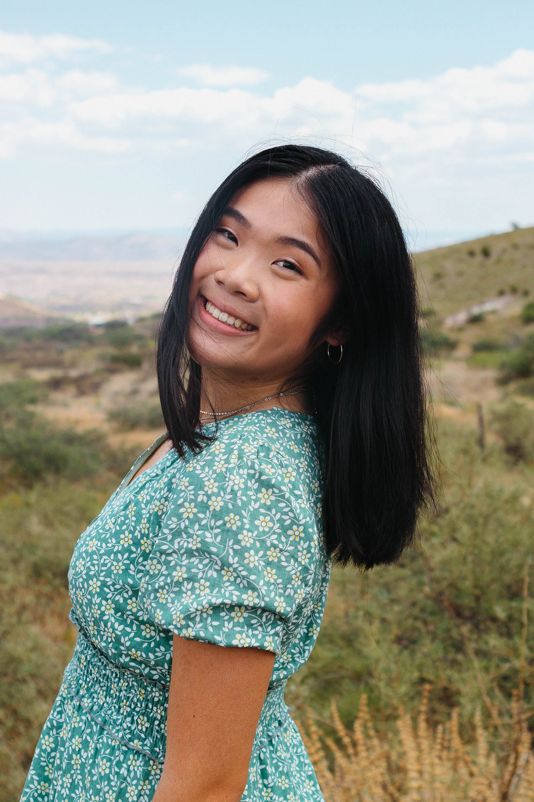

# Kathy's User Page

## An Intro to Kathy as a programmer and a person!


**Welcome to my User Page!**

[<p align="center">
    
</p>]

## Table of Contents
- [Kathy's User Page](#kathys-user-page)
  - [An Intro to Kathy as a programmer and a person!](#an-intro-to-kathy-as-a-programmer-and-a-person)
  - [Table of Contents](#table-of-contents)
    - [Basic Info:](#basic-info)
    - [Programmer Info:](#programmer-info)
  - [What I Hope To Learn In CSE 110:](#what-i-hope-to-learn-in-cse-110)

Now, before I explain who I am as a *programmer*, let me let you in on some information about myself as a person!

### Basic Info:
- Hometown: Phoenix, AZ
- Grad. Year: 2025
- College: Sixth College
- Hobbies:
  - dance
  - baking
  - concerts

Current favorite song lyric:
> "there's no hiding from the thought of us, I've got ways to find you anywhere"

### Programmer Info:

Current courseload:
1. CSE 110
2. CSE 101
3. MATH 183
4. CSE 140L
5. CSE198

Current Project: [FAVITES-Lite](https://github.com/niemasd/FAVITES-Lite) - an epidemic reconstruction tool (Prof. Niema Moshiri)

example chunk of parameter json files used:
```
{"Contact Network": {"model": "Complete", "param": {"n": 100}}, "Transmission Network": {"model": "Susceptible-Infected-Removed (SIR)"
```

[Favorite Programmng Language](README.md)

## What I Hope To Learn In CSE 110:
- [ ] communication skills
- [ ] how to develop something from start to finish
- [ ] new dev tools
- [ ] better testing techniques